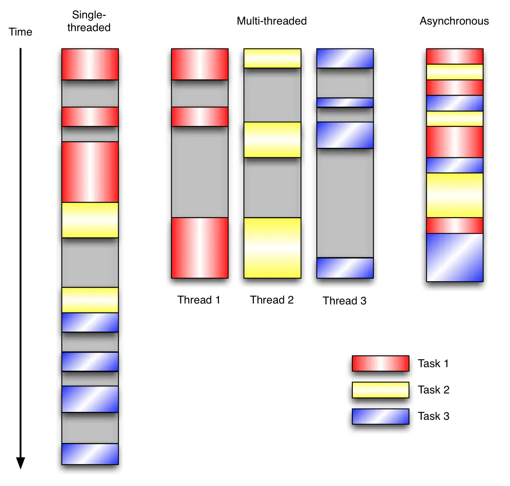

> Node.js 是单进程单线程应用程序，但是因为 V8 引擎提供的异步执行回调接口，通过这些接口可以处理大量的并发，所以性能非常高。

<!-- more -->

首先由于 V8 引擎的卓越性能，以及大多数的 GUI 都才用事件驱动模型来响应用户事件，所以 node 的事件循环是使用了事件驱动模型。

## 事件驱动模型

什么叫事件驱动模型？我们传统的事件处理模型的是线性的。就如同小学时的烧开水问题，线性的处理事件是单线程的。

> 开始 → 烧开水 → 切菜 →……→ 结束

整个事件处理上是线性的，这样的处理模型是实现难度很低，开发很容易的。一个我将需要的任务一个个的做完这是最容易想到的办法 ~~相应的多线程就是多个我来干活 XD~~

但是来到事件驱动模型上，我们首先接收到事件，但并不进行处理，而是将其放入一个事件队列，然后继续接收事件请求。

当没有事件时，再转到事件队列进行处理。如下的处理流程

> 开始 → 烧开水（不需要人一直在）　　　　　 → 　结束<br>
> 　　　　　　 → 　切菜　 → 　继续别的任务

多个任务交错执行，但还是只有我一个人来做任务。在事件循环中查询所有的事件，然后当需要的时候将其分配给等待处理事件的函数（当任务需要的时候再由本人进行操作），这样就可以让整个流程尽可能快的执行且不需要额外的线程~~人手~~

## Node.js 中的模型

众所周知的 node.js 作为一个单进程单线程程序，我们的 js 会运行在单个进程的单个线程上。首先严格意义上来讲。nodejs 不是单线程架构，因为他有 I/O 线程，定时器线程等等，只不过这些都是由更底层的 libuv 处理，libuv 将执行结果放入到队列中等待执行，这就来到了 nodejs 的事件循环了。

从 Node.js 运行，就将会初始化事件循环。事件循环大致可以分为六个阶段

```
   ┌───────────────────────────┐
┌─>│           timers          │
│  └─────────────┬─────────────┘
│  ┌─────────────┴─────────────┐
│  │     pending callbacks     │
│  └─────────────┬─────────────┘
│  ┌─────────────┴─────────────┐
│  │       idle, prepare       │
│  └─────────────┬─────────────┘      ┌───────────────┐
│  ┌─────────────┴─────────────┐      │   incoming:   │
│  │           poll            │<─────┤  connections, │
│  └─────────────┬─────────────┘      │   data, etc.  │
│  ┌─────────────┴─────────────┐      └───────────────┘
│  │           check           │
│  └─────────────┬─────────────┘
│  ┌─────────────┴─────────────┐
└──┤      close callbacks      │
   └───────────────────────────┘
```

上述每一个阶段都会维护一个**FIFO**的可执行队列。

当事件循环进入到其中一个阶段时，其会执行该阶段的任何操作。直到这个阶段的任务队列为空，或者是回调函数的调用次数达到上限。此时事件循环将会到下一个阶段。

**各个阶段的介绍**

1. timer：这个阶段执行通过 setTimeout()和 setInterval()设置的回调函数

2. I/O callback:执行延迟到下一个循环迭代的 I/O 回调

3. idle,prepare：系统调用，也就是 liuv 调用

4. poll:轮询阶段，检测新的 I/O 事件，执行与 I/O 相关的回调，（几乎所有的回调都是关闭回调，定时器调度的回调，以及 setImmaditate()）,node 会在此阶段适当的阻塞

5. check：此阶段调用 setImmediate()设置的回调

6. close callbacks：一些关闭回调，比如说 socket.on('close',...)

---

对于 Node.js 的事件驱动模型，我们的主要处理在于 poll 轮询阶段。当 node.js 在这个阶段读取到一个事件时，将调用与这个事件关联的回调函数，然后继续到队列中查看是否有下一个事件，如果有，就处理这个事件，直至处理完当前的队列。

然后关键的来了，当之前与事件关联的回调函数操作完后，node.js 会将执行回调函数的引用加入到事件队列中，由于事件循环每一轮每一轮都会来到轮询阶段检测事件，就会检测到新的这个事件，完成全部的处理。

事件循环的模型可以简单视为下图


# 总结

回到最初 我们用的栗子。一个人做一个清单的任务，有几种处理方式其实分别对应单线程、多线程以及事件驱动编程模型。其实可以让我们用例子来比较和对比一下单线程、多线程以及事件驱动编程模型。下图中展示了随着时间的推移，这三种模式下程序所做的工作。这个程序有 3 个任务需要完成，每个任务都在等待 I/O 操作时阻塞自身。阻塞在 I/O 操作上所花费的时间已经用灰色框标示出来了。



> **单线程同步模型**<br>
> 任务按照顺序执行。如果某个任务因为 I/O 而阻塞，其他所有的任务都必须等待，直到它完成之后它们才能依次执行。这种明确的执行顺序和串行化处理的行为是很容易推断得出的。如果任务之间并没有互相依赖的关系，但仍然需要互相等待的话这就使得程序不必要的降低了运行速度。

> **多线程版本**<br>
> 这 3 个任务分别在独立的线程中执行。这些线程由操作系统来管理，在多处理器系统上可以并行处理，或者在单处理器系统上交错执行。这使得当某个线程阻塞在某个资源的同时其他线程得以继续执行。与完成类似功能的同步程序相比，这种方式更有效率，但程序员必须写代码来保护共享资源，防止其被多个线程同时访问。多线程程序更加难以推断，因为这类程序不得不通过线程同步机制如锁、可重入函数、线程局部存储或者其他机制来处理线程安全问题，如果实现不当就会导致出现微妙且令人痛不欲生的 bug。

> **事件驱动模型**<br>
> 在事件驱动版本的程序中，3 个任务交错执行，但仍然在一个单独的线程控制中。当处理 I/O 或者其他昂贵的操作时，注册一个回调到事件循环中，然后当 I/O 操作完成时继续执行。回调描述了该如何处理某个事件。事件循环轮询所有的事件，当事件到来时将它们分配给等待处理事件的回调函数。这种方式让程序尽可能的得以执行而不需要用到额外的线程。事件驱动型程序比多线程程序更容易推断出行为，因为程序员不需要关心线程安全问题。

---

**优缺点补充：**

> 以下内容来自<https://blog.csdn.net/jmxyandy/article/details/7338889>

**ThreadPerConnection 的多线程模型（比如 Java）**
优点：简单易用，效率也不错。在这种模型中，开发者使用同步操作来编写程序，比如使用阻塞型 I/O。使用同步操作的程序能够隐式地在线程的运行堆栈中维护应用程序的状态信息和执行历史，方便程序的开发。

缺点：没有足够的扩展性。如果应用程序只需处理少量的并发连接，那么对应地创建相应数量的线程，一般的机器都还能胜任；但如果应用程序需要处理成千上万个连接，那么为每个连接创建一个线程也许是不可行的。

**事件驱动的单线程模型**
优点：扩展性高，通常性能也比较好。在这种模型中，把会导致阻塞的操作转化为一个异步操作，主线程负责发起这个异步操作，并处理这个异步操作的结果。由于所有阻塞的操作都转化为异步操作，理论上主线程的大部分时间都是在处理实际的计算任务，少了多线程的调度时间，所以这种模型的性能通常会比较好。

缺点：要把所有会导致阻塞的操作转化为异步操作。一个是带来编程上的复杂度，异步操作需要由开发者来显示地管理应用程序的状态信息和执行历史。第二个是目前很多广泛使用的函数库都很难转为用异步操作来实现，即是可以用异步操作来实现，也将进一步增加编程的复杂度。

**并发系统通常既包含异步处理服务，又包含同步处理服务。系统程序员有充分的理由使用异步特性改善性能。相反，应用程序员也有充分的理由使用同步处理简化他们的编程强度。**

---

所以当我们面对如下的环境时，事件驱动模型通常是一个好的选择：

- 程序中有许多任务，而且…
- 任务之间高度独立（因此它们不需要互相通信，或者等待彼此）而且…
- 在等待事件到来时，某些任务会阻塞。

_参考资料_

- <https://www.jianshu.com/p/9faada4cd977>
- <https://www.runoob.com/nodejs/nodejs-event-loop.html>
- <https://www.jdon.com/idea/nodejs/tutorial.html>
- <https://www.jianshu.com/p/4de50514ea7f>
