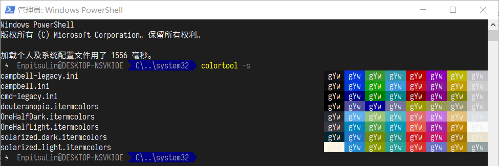

**终端**，是用户与操作系统进行交互的最原始的输入输出环境，也是一些高级系统操作必要工具。
经常调试脚本，使用 git 频率多，于是今天决定配一个好用的 shell 来当做学习环境。

<!-- more -->

下面就开始调教 window10 自带的其实十分强大~~但是有点丑~~的 **powershell**

## 更换 PowerShell 的配色

微软官方提供了一个更换 PowerShell 配色的小工具：ColorTool.exe，我们可以利用它来更换 PowerShell 的主题颜色。

我们可以从 ColorTool 的 [GitHub 页面](https://github.com/Microsoft/console/releases) 下载这个小工具。当然，如果你使用 Scoop 或者 Chocolatey，也可以这样安装：

Scoop

```shell{promptUser:enpitsulin}
scoop install colortool
```

Chocolatey

```shell{promptUser:enpitsulin}
choco install colortool
```

这里我更加推荐利用 **Scoop** 这个优质的包管理来安装 ColorTool。

---

ColorTool 使用非常简单。我们可以利用下面这个命令进行查看工具自带的几个主题：

```shell{promptUser:enpitsulin}
# 注：-s 代表 schemes
colortool -s
```



前面的几个 .ini 和 .itermcolors 就是主题配置文件，我们可以直接通过下面这个命令设置主题：

```shell{promptUser:enpitsulin}
# 临时查看
colortool <主题名称>
# 定义默认值
colortool -d <主题名称>
```

比如我们希望将主题配色更换为
OneHalfDark.itermcolors，只需要输入下面这个命令就可以更换并预览更新：

```shell{promptUser:enpitsulin}
colortool OneHalfDark
```

> 由于 ColorTool 直接支持 iTerm 主题配置文件，因此我们可以在 iterm2colorschemes 这个网站找到我们想要的主题背景进行配置，方法和上面介绍的一样：在 PowerShell 中定位至你希望更换的主题文件，使用命令 `colortool <主题名称>.itermcolors` 进行配置即可。同时，如果你对上面的主题都不满意，你也可以直接在这个网站： terminal.sexy 自行配置自己想要的主题，并通过同样的方式进行应用。

## 改进 PowerShell 的字体

对于大多数人来说默认 PowerShell 的`新宋体`真的是十分的丑。
由于微软对控制台字体的元数据有限制：

> 这些字体必须满足以下条件，可在命令会话窗口中：
> 　该字体必须是等宽字体。
> 　该字体不能为斜体字体。
> 　该字体不能有 A 或 C 负空间。
> 　如果是 TrueType 字体，则它必须是 FF_MODERN。
> 　如果它不是 TrueType 字体，则它必须是 OEM_CHARSET。
> 对于亚洲字体的附加条件：
> 　如果不是 TrueType 字体，字体名必须是“Terminal”。
> 　如果它是亚洲的 TrueType 字体，它还必须使用亚洲语言的字符集。

可能大多数人喜欢使用适合于编程的等宽字体如 Consolas 作为 Powershell 的字体,但这里推荐一款`Sarasa Gothic / 更纱黑体 / 更紗黑體 / 更紗ゴシック`(更纱黑体)，可以从更纱黑体的 [GitHub 页面](https://github.com/be5invis/Sarasa-Gothic/releases)下载。

下载解压安装更纱黑体之后，我们重新启动一个 PowerShell 终端，就可以在菜单栏右键，选择`属性-字体`，并在字体中选择更纱黑体。适合终端使用的等宽字体是`等距更纱黑体 T SC`或`Sarasa Mono T SC`。

至此字体就从别扭的`新宋体`改到了`更纱黑体`

## 定制 PowerShell 中的 Prompt 单元

PowerShell 等 Shell 的一个基本的命令单元大致如下：

- 前面的部分就是 Prompt，能够展示包括用户、系统、开发环境、版本控制等等有用的信息
- 后面的部分是具体的命令，也就是我们每次执行操作时输入命令的位置


### 安装 oh-my-posh

我们需要先以管理员权限启动 PowerShell，以便执行安装操作。（具体是在开始按钮上点击右键，选择“Windows PowerShell (管理员)”。

然后，运行命令以安装 posh-git，这是 oh-my-posh 的依赖。

```shell{promptUser:enpitsulin}
Install-Module posh-git -Scope CurrentUser
```

如果此前没有安装 NuGet 提供程序，则此时会提示安装 NuGet；如果此前没有开启执行任意脚本，此处也会提示执行脚本。如果没有权限执行脚本，可能需要先执行

```shell{promptUser:enpitsulin}
Set-ExecutionPolicy Bypass
```

接下来，运行命令以安装 oh-my-posh 本身。

```shell{promptUser:enpitsulin}
Install-Module oh-my-posh  -Scope CurrentUser
```

到这里 oh-my-posh 就安装完毕

---

### 配置 oh-my-posh

接下来，我们需要对 oh-my-posh 进行配置
首先

```shell{promptUser:enpitsulin}
if (!(Test-Path -Path $PROFILE )) { New-Item -Type File -Path $PROFILE -Force }
notepad $PROFILE
```

然后再打开的记事本文档中添加下列内容

```
Import-Module posh-git
Import-Module oh-my-posh
Set-Theme Agnoster
```

如果一切顺利的话重启你的 Powershell 就会发现已经变得和本节开头的示意图一样了。

---

PS：配置文件的最后一句`Set-Theme Agnoster`的作用就是配置主题。我们可以在配置文件里面修改这个命令中的 Agnoster 即「主题名」来更换主题。更多的主题可以[oh-my-posh 的文档#主题](https://github.com/JanDeDobbeleer/oh-my-posh#themes)中查看。

## 使用第三方终端与 Powershell 协同工作

现在我所使用的和文章内截图所示的都是基于 ConEmu+Powershell 的效果
~~咕咕咕~~

### 更贴近 win10 风格的第三方终端

#### Fluent Terminal

试用一段时间弃，确实很华丽。

#### Hyper

未尝试

#### Terminus

未尝试

### ConEmu

## 使用 WSL + zsh

这方面我也不是很懂.jpg 留个位置以后有机会试试

## 结束

至此对 win10 的默认终端 Powershell 调教完成。然后享受吧。
